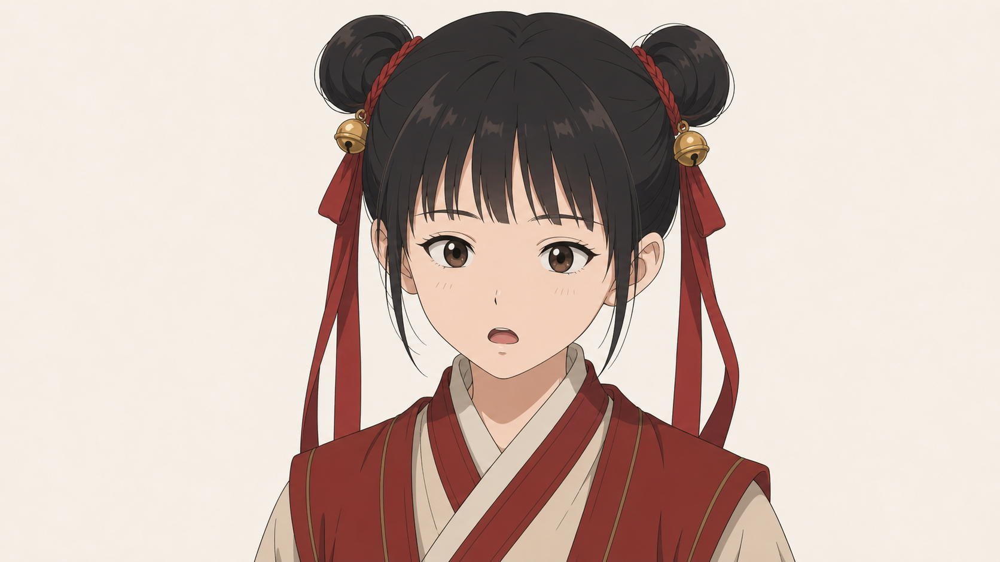

# 李宝瓶固定脸部身份与当前服装标准

> 适用范围：后续所有李宝瓶立绘、表情差分、动作差分、剧情状态图、双人同场图、半身像、全身像与场景图。  
> 核心原则：后续不是重新设计李宝瓶，而是让“同一个李宝瓶”进入不同镜头、表情、动作和场景。

---

## 0. 当前正式资产

- `lh/lbp/lbp_face_close_v1.png`：当前近景锁脸母版，第一优先。
- `lh/lbp/lbp_face_34_v1.png`：当前三分之四侧近景母版，侧脸、回头、侧听镜头第一优先。
- `lh/lbp/lbp_exp_sheet_v1.png`：当前正式表情页，表情差分第一优先。
- 旧全身母版文件已不在当前目录，后续文档不再引用旧路径。
- 当前目录内也不存在可直接调用的正式全身书院母版；服装结构暂时以本文字标准锁定。

---

## 1. 一句话口径

**李宝瓶是书院读书时期的小姑娘版本：小脸、细下巴、清秀收束的杏眼、齐刘海高双髻、金铃发饰、红发带、红色日常书院服，气质要灵、真、稳、旧时代，不做偶像化古风少女。**

---

## 2. 脸部身份锁定

脸部是最高优先级。后续所有李宝瓶图片，第一眼必须仍然是同一个人。

### 必须保持

- 小脸。
- 细下巴。
- 下庭偏短，但不圆萌。
- 面颊有一点小姑娘的软感，不削薄，不成熟。
- 眼睛是收束的清秀杏眼，不夸张放大，不做甜妹圆眼。
- 黑眼珠存在感清楚，眼神干净、聪明、认真。
- 小鼻子，小嘴，嘴角克制，不做妆感唇形。

### 严禁漂移

- 成熟少女脸。
- 网红脸。
- 古偶精修脸。
- 偶像化古风模板脸。
- 二次元萌系大圆眼。
- 过瘦过尖的锥子脸。

---

## 3. 发型与头饰锁定

### 必须保持

- 黑发。
- 齐刘海。
- 两侧高双髻。
- 双髻附近有小巧金铃发饰。
- 双髻旁有红发带自然垂下。

### 严禁漂移

- 改成双马尾、披发、单髻或复杂大髻。
- 去掉金铃发饰。
- 去掉红发带。
- 把头饰做得过大、过亮、过华丽。

---

## 4. 当前服装锁定

当前服装以“书院读书时期红色日常服”为唯一方向，不再口头沿用不存在的旧全身母版。

### 必须保持

- 红色为主的日常书院服。
- 交领内层结构清楚。
- 外层书院服结构清楚。
- 腰间系带克制整洁。
- 整体低饱和、轻书卷气、不过度装饰。
- 布料真实，有旧时代使用感。

### 严禁漂移

- 旅装。
- 江湖短打。
- 武侠装。
- 仙侠长裙。
- 华丽贵族礼服。
- 大面积金纹、复杂腰饰、花哨绳结。

---

## 5. 表情与动作边界

### 推荐表情范围

- 平静。
- 认真。
- 疑惑。
- 微笑。
- 小得意。
- 有点委屈。
- 说话。

### 推荐动作范围

- 标准站姿。
- 半侧身回头。
- 轻提一只手。
- 认真听话。
- 倔强站定。
- 与他人同场时的小幅关系动作。

### 动作原则

- 先稳脸，再稳姿态，再追求演出感。
- 优先小动作，不优先大动作。
- 头转过去时，双髻、红发带和视线要一起跟过去。
- 如动作会明显破坏脸、手或身体结构，宁可减动作。

### 高风险动作

- 大跑大跳。
- 大幅转身。
- 双手复杂手势。
- 强情绪配强动作。
- 高俯视或低仰视下的大动作。

---

## 6. 统一风格锁定

后续如无用户明确要求切换风格，默认全部遵守以下口径。

### 总原则

- `东方幻想`
- `宋代审美`
- `半写实`
- `山水志怪`
- `人间烟火`
- `沉静克制`
- `电影级构图`
- `自然情绪光影`
- `高级灰配色`
- `真实材质结构`

### 人物方向

- `半写实东方人物`
- `宋韵骨相`
- `克制表情`
- `真实年龄感`
- `真实阶层感`
- `读书人气`
- `旧时代人物气息`
- `非偶像化古风`
- `非二次元萌系`
- `自然五官比例`
- `低饱和服饰配色`
- `真实服装结构`
- `布料层次清晰`
- `轻磨损与使用痕迹`

### 严禁画成

- `仙侠网游风`
- `古偶电视剧风`
- `页游风`
- `二次元萌系风`
- `流行修仙爽文风`

---

## 7. 当前正式引用规则

- 做正面或近正面近景时，优先对齐 `lh/lbp/lbp_face_close_v1.png`。
- 做三分之四侧、轻回头、侧听镜头时，优先对齐 `lh/lbp/lbp_face_34_v1.png`。
- 做表情差分时，优先对齐 `lh/lbp/lbp_exp_sheet_v1.png`。
- 任何新图如果更好看但不像这三张资产所对应的同一个李宝瓶，直接判定失败。

---

## 8. 配套文档

- `lh/lbp/lbp_chat_start.md`：新聊天起手模板，只保留执行入口，不再重复整份身份标准。
- `lh/lbp/lbp_asset_plan.md`：当前补图顺序与待办清单。
- `lh/lbp/lbp_face_close_v1_prompt.md`：近景锁脸类提示词归档。

---

## 9. 执行口径

- 优先稳脸，其次稳发型头饰，再稳服装结构。
- 场景变化时，脸部身份不得漂向更成熟、更甜、更偶像化。
- 服装可在当前书院服范围内做轻微层次变化，但不得改方向。
- 如果后续补出正式全身母版，应新建真实存在的文件，再回写本文档与索引；不要恢复引用旧路径。
