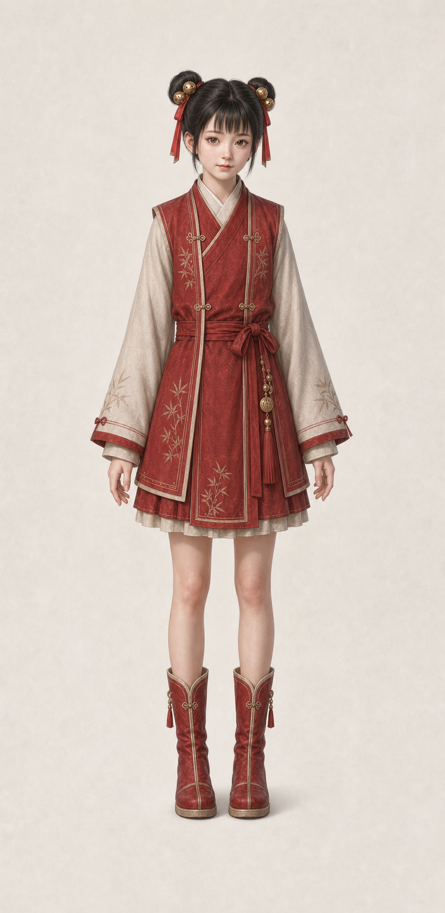

# 李宝瓶固定脸部身份与当前服装标准

> 适用范围：后续所有李宝瓶立绘、表情差分、动作差分、剧情状态图、双人同场图、半身像、全身像与场景图。  
> 核心原则：后续不是重新设计李宝瓶，而是让“同一个腾讯动画版李宝瓶”进入不同场景、表情和动作。  
> 当前确认基准：以本线程确认的正式书院版母版为最高优先级。


## 0. 当前锁定母版

- 当前固定脸部身份与当前服装母版：`lh/lbp/lbp_master_academy_agents_v1.png`
- 后续如无用户明确要求切换版本，李宝瓶相关出图默认优先对齐这张母版。
- 本母版口径：书院读书时期红色日常服、全身纯站姿、低饱和、半写实、宋代审美、沉静克制。
- `lh/lbp/lbp.png` 仅保留为早期历史草稿参考，不再作为默认母版。



---

## 1. 一句话最终口径

**腾讯动画版李宝瓶，齐刘海双髻，金铃发饰红发带，小脸细下巴，柔和杏眼，书院读书时期红色日常服，全身纯站姿；后续只允许改变表情、动作、镜头和场景，不允许重新设计脸、发型和当前母版服装方向。**

---

## 2. 角色定位与整体气质

李宝瓶是《剑来》腾讯动画版中的小姑娘角色。她不是泛化古风少女，也不是元气冒险女孩，更不是偶像化古风模板脸。

### 必须保持

- 小姑娘年龄感。
- 清秀、灵动、乖巧、机灵。
- 有一点认真和倔劲。
- 表情可以活泼，但不能卖萌过度。
- 有书院读书时期的整洁与书卷气。

### 禁止偏移

- 不要变成成熟少女或网红脸。
- 不要变成夸张二次元萌系角色。
- 不要变成旅行少女、江湖少女、侠女或仙侠女主。
- 不要把她画成偶像化、精修感过重的古风模板人物。

---

## 3. 脸部身份锁定

脸部是最高优先级。后续所有李宝瓶图片，第一眼必须仍然是同一个腾讯动画版李宝瓶。

### 3.1 脸型

必须保持：

- 小脸。
- 额头与上庭干净、自然。
- 面颊有一点小姑娘的软感。
- 脸部轮廓柔和。
- 下巴细收。
- 下庭偏短，但不圆萌。

禁止：

- 圆脸、包子脸。
- 宽下颌。
- 成熟瓜子脸。
- 网红尖脸。
- 过瘦、过削的锥子脸。
- 偶像化少女脸。

### 3.2 眼睛

必须保持：

- 清秀杏眼。
- 眼裂偏圆润，但不是夸张圆眼。
- 上眼睑线条柔和。
- 黑眼珠存在感明显，眼神干净。
- 眼神有小姑娘的聪明和认真。

禁止：

- 超大圆眼。
- 夸张二次元萌眼。
- 过度水汪汪的大眼。
- 空洞、呆萌化眼神。
- 过长、过挑、过媚的成熟女性眼型。

### 3.3 鼻口

必须保持：

- 小鼻子，线条克制。
- 鼻梁提示轻，重点在小巧鼻头与自然鼻尖。
- 小嘴，表情自然。
- 嘴角轻，不做明显唇峰和妆感。

禁止：

- 厚唇。
- 大嘴。
- 成熟精致妆感。
- 夸张漫画嘴型。
- 过于成人化的鼻梁和嘴唇刻画。

---

## 4. 发型与头部配饰锁定

### 4.1 发型

必须保持：

- 黑发。
- 齐刘海。
- 两侧高双髻。
- 头发整体干净、柔顺。

禁止：

- 普通双马尾。
- 披发。
- 单髻。
- 复杂发髻。
- 仙侠高冠。
- 成熟女性发型。

### 4.2 金铃发饰

必须保持：

- 每侧双髻附近有金色铃铛状圆形发饰。
- 铃铛数量感接近参考图。
- 发饰小巧明确，不夸张放大。

禁止：

- 巨大铃铛。
- 过多铃铛堆叠。
- 把铃铛改成普通珠子、花朵、玉饰或复杂头冠。

### 4.3 红发带

必须保持：

- 双髻旁有红色发带垂下。
- 发带有清楚垂坠感。
- 可有小流苏，但要克制。

禁止：

- 去掉红发带。
- 发带过长、过飘、过复杂。
- 改成花哨飘带或仙气丝带。

---

## 5. 当前服装标准

当前服装不再沿用早期冬装草稿口径，统一以当前母版的**书院读书时期红色日常服**为唯一标准。

### 5.1 服装总印象

必须保持：

- 红色为主的书院日常服。
- 古代书院读书时期气质。
- 整洁、轻书卷气、轻阶层感。
- 全身纯站姿母版可长期复用的稳定结构。
- 少女感存在，但不过分甜美。

禁止：

- 旅装。
- 短袄。
- 武侠装。
- 江湖短打。
- 仙侠长裙。
- 华丽贵族礼服。
- 过度装饰化的古偶服装。

### 5.2 当前母版服装结构

必须保持：

- 红色书院服主色。
- 交领内层结构清楚。
- 红色外层书院服或书生式罩衣结构清楚。
- 腰间有整洁克制的系带或腰绳。
- 下摆长度为当前母版这类短一些的书院日常服长度。
- 层次清楚，但不要复杂堆料。

禁止：

- 拖地长摆。
- 旅行斗篷结构。
- 过多挂件。
- 复杂腰饰。
- 花哨绳结。
- 大面积金纹。

### 5.3 袖子与下装

必须保持：

- 袖子有书院服的规整感。
- 衣摆和下装适合读书时期少女，不做厚重江湖装备感。
- 布料层次清楚、真实。

禁止：

- 仙侠飘袖。
- 过窄紧袖。
- 武侠护腕感。
- 下装过于成熟、礼服化或战斗化。

---

## 6. 道具口径

当前正式母版默认：

- 不带书箱。
- 不带竹编箱。
- 不带卷轴。
- 不带额外手持道具。

只有用户明确要求，或某一场戏确实需要时，才单独加入对应道具。

禁止：

- 把道具当成李宝瓶默认识别点。
- 在默认立绘母版里强行加入箱子、书卷、背包或其他额外物件。

---

## 7. 允许变化范围

### 表情

- 微笑。
- 认真。
- 疑惑。
- 眨眼。
- 说话。
- 小得意。
- 有点委屈。
- 托腮。
- 指着说话。

### 动作

- 标准站姿。
- 指人说话。
- 蹲坐。
- 吃饭。
- 回头。
- 小跑。
- 与陈平安同场互动。

### 场景

- 书院庭院。
- 书院回廊。
- 书院藏书处。
- 山林书院周边。
- 石路。
- 湖边。
- 林间空地。
- 篝火旁。

---

## 8. 绝对禁止清单

后续生成李宝瓶时，以下情况视为不合格：

- 夸张铃铛。
- 复杂腰饰。
- 花哨绳结。
- 过圆大眼。
- 泛化古风小女孩。
- 变成普通元气少女。
- 变成旅行冒险少女。
- 变成熟少女。
- 变网红脸。
- 变仙侠长裙。
- 变武侠侠女。
- 去掉双髻。
- 去掉红发带。
- 改掉当前书院服主方向。
- 把书院服改成旅装、短打、江湖装或仙侠礼服。

---

## 9. 通用生成提示词模板

### 9.1 彩色图通用模板

```text
基于腾讯动画版李宝瓶参考素材和当前正式母版，保持同一人物身份，不重新设计角色。
画面中是李宝瓶：小姑娘年龄感，小脸细下巴，略带软感的面颊，清秀杏眼，黑发齐刘海，两侧高双髻，双髻旁有小巧金铃发饰，红色发带自然垂下。她穿书院读书时期红色日常服，交领内层清楚，红色外层书院服结构清楚，腰间系带克制，整体整洁、轻书卷气、低饱和、半写实。
场景：[填写具体场景]
动作：[填写具体动作]
表情：[填写具体表情]
镜头：[填写半身/近景/全身/三分之四视角]
风格：东方幻想，宋代审美，半写实，沉静克制，真实材质结构，非偶像化古风，非二次元萌系。
```

### 9.2 负面提示词

```text
不要网红脸，不要成熟少女，不要夸张萌系大眼，不要偶像化古风脸，不要旅装，不要短袄，不要武侠装，不要江湖短打，不要仙侠长裙，不要华丽贵族礼服，不要过度装饰，不要箱子，不要卷轴，不要背包，不要文字，不要水印。
```

---

## 10. 出图验收清单

每次生成李宝瓶图片后，按以下顺序检查：

1. 第一眼是否仍是腾讯动画版李宝瓶。
2. 脸是否小，是否细下巴，是否保留小姑娘面颊软感。
3. 眼睛是否仍是柔和杏眼，而不是超大圆眼或成熟媚眼。
4. 是否有齐刘海和高双髻。
5. 双髻旁是否有小巧金铃发饰。
6. 是否有红发带垂下。
7. 是否仍是书院读书时期红色日常服方向。
8. 服装是否整洁、低饱和、轻书卷气，而不是旅装或江湖装。
9. 是否避免复杂腰饰、花哨绳结、夸张铃铛。
10. 场景变化后，脸部身份是否仍然稳定，没有漂向更成熟、更偶像化。

---

## 11. 风格锁定（按 `AGENTS.md`）

- `东方幻想`
- `宋代审美`
- `半写实`
- `沉静克制`
- `高级灰配色`
- `真实材质结构`
- `半写实东方人物`
- `真实年龄感`
- `真实阶层感`
- `读书人气`
- `少年未雕琢感`
- `非偶像化古风`
- `非二次元萌系`
- `自然五官比例`
- `低饱和服饰配色`
- `真实服装结构`
- `布料层次清晰`
- `轻磨损与使用痕迹`

---

## 12. 执行口径

- 优先稳脸，其次稳站姿，再稳服装细节。
- 场景变化时，脸部身份不得漂向更成熟、更精致、更偶像化。
- 即使进入不同光线和场景，仍应优先保住“书院读书时期的小姑娘李宝瓶”。
- 服装可以在当前书院服范围内做轻微层次变化，但不得偏成旅装、短打、江湖装或仙侠礼服。
- 后续正式母版文件统一优先使用：`lh/lbp/lbp_master_academy_agents_v1.png`
