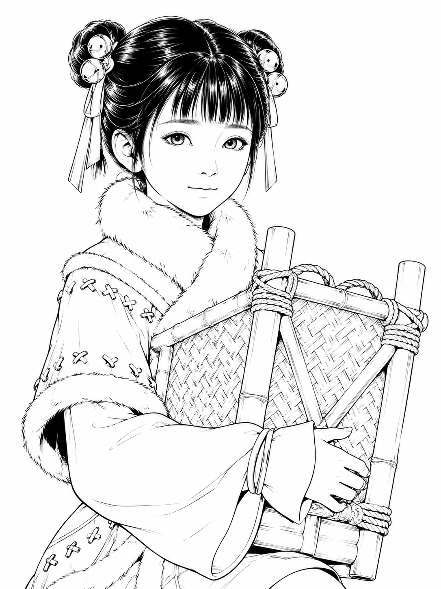

# 李宝瓶固定脸部身份与当前服装标准

> 适用范围：后续所有李宝瓶立绘、表情差分、动作差分、剧情状态图、双人同场图、黑白草稿、二值线稿、半身像与场景图。  
> 核心原则：后续不是重新设计李宝瓶，而是让“同一个腾讯动画版李宝瓶”进入不同场景、表情和动作。  
> 当前确认基准：以本轮确认的二值黑白线稿版为当前草稿基准，同时以用户提供的腾讯动画版截图素材作为身份、服装和道具参考。

---

## 0. 当前锁定母版

- 当前固定脸部身份与当前服装母版：`lh/lbp/lbp.png`
- 后续如无用户明确要求切换版本，李宝瓶相关出图默认优先对齐这张母版。



---

## 1. 一句话最终口径

**腾讯动画版李宝瓶，齐刘海双髻，金铃发饰红发带，红白厚毛领冬装，抱绿色竹编箱，清秀杏眼，小脸细下巴；后续只允许改变表情、动作、镜头和场景，不允许重新设计脸、发型、服装识别点和核心道具。**

---

## 2. 角色定位与整体气质

李宝瓶是《剑来》腾讯动画版中的小姑娘角色。她的视觉核心不是泛化古风少女，也不是普通元气旅行女孩，而是具有明确动画模型特征的李宝瓶。

### 必须保持

- 小姑娘年龄感。
- 清秀、灵动、乖巧、机灵。
- 有一点认真和倔劲。
- 表情可以活泼，但不能卖萌过度。
- 造型干净、明确、可长期复用。

### 禁止偏移

- 不要变成泛化古风小女孩。
- 不要变成成熟少女或网红脸。
- 不要变成夸张二次元萌系角色。
- 不要过度旅行少女化、冒险少女化。
- 不要把李宝瓶画成“红衣小侠女”或“铃铛少女”的新设计。

---

## 3. 脸部身份锁定

脸部是最高优先级。后续所有李宝瓶图片，第一眼必须仍然是同一个腾讯动画版李宝瓶。

### 3.1 脸型

必须保持：

- 小脸。
- 脸部轮廓柔和。
- 下巴细收。
- 下庭偏短但不圆萌。
- 侧脸和半侧脸都要保持清秀小姑娘感。

禁止：

- 圆脸、包子脸。
- 宽下颌。
- 成熟瓜子脸。
- 网红尖脸。
- 偶像化少女脸。

### 3.2 眼睛

必须保持：

- 清秀杏眼。
- 眼睛柔和、灵动。
- 眼距和眼型接近腾讯动画版 3D 模型。
- 眼神有小姑娘的聪明和认真。

禁止：

- 超大圆眼。
- 夸张二次元萌眼。
- 过度水汪汪的大眼。
- 眼神空洞、呆萌化。
- 过度成熟妩媚眼。

### 3.3 鼻口

必须保持：

- 小鼻子，线条克制。
- 小嘴，表情自然。
- 微笑、疑惑、认真、说话、眨眼都可以，但要保持李宝瓶的脸部比例。

禁止：

- 厚唇。
- 大嘴。
- 成熟精致妆感。
- 夸张漫画嘴型。

---

## 4. 发型与头部配饰锁定

发型是李宝瓶第一识别点之一，不能随意改。

### 4.1 发型

必须保持：

- 黑发。
- 齐刘海。
- 两侧双丸子头 / 双髻。
- 双髻位置偏高。
- 头发整体干净、柔顺，有腾讯动画版 3D 模型感。

禁止：

- 普通双马尾。
- 披发。
- 单髻。
- 复杂发髻。
- 仙侠高冠。
- 成熟女性发型。

### 4.2 金铃发饰

必须保持：

- 每侧双髻附近有金色铃铛状圆形发饰。
- 铃铛数量感要接近参考图。
- 发饰应小巧明确，不能夸张放大。

禁止：

- 巨大铃铛。
- 过多铃铛堆叠。
- 把铃铛变成普通珠子、花朵、玉饰或复杂头冠。

### 4.3 红发带

必须保持：

- 双髻旁有红色发带垂下。
- 红发带应有清楚的垂坠感。
- 可以有小流苏，但要克制。

禁止：

- 去掉红发带。
- 发带过长、过飘、过复杂。
- 改成花哨飘带或仙气丝带。

---

## 5. 当前服装标准

当前服装以腾讯动画版红白冬装为唯一标准。后续没有特别说明时，默认使用这套服装。

### 5.1 服装总印象

必须保持：

- 红白冬装 / 红白棉袄感。
- 厚实、可爱但不幼稚。
- 具有动画版李宝瓶的明确识别。
- 服装结构简洁，不做复杂重设计。

禁止：

- 改成普通古风襦裙。
- 改成仙侠长裙。
- 改成华丽贵族服。
- 改成旅行斗篷装。
- 改成武侠侠女装。

### 5.2 白色厚毛领

白色厚毛领是核心识别点，优先级很高。

必须保持：

- 脖颈处有非常明显的厚白毛领。
- 毛领围绕肩颈形成柔软厚实的一圈。
- 毛领可有绒毛线条，但不能乱成杂毛。

禁止：

- 去掉毛领。
- 把毛领画薄。
- 改成普通围巾。
- 改成仙气披帛。

### 5.3 红色外衣

必须保持：

- 红色短袄 / 红色外衣结构。
- 白色毛边。
- 肩胸处有白色斜向毛边结构。
- 衣服上有浅色小扣 / 小三角装饰。
- 整体短而利落，不是拖地长裙。

禁止：

- 复杂腰饰。
- 花哨绳结。
- 大量挂件。
- 大面积金纹。
- 改成华丽礼服。

### 5.4 袖子与腕部

必须保持：

- 宽白袖。
- 袖口柔软，有冬装厚度。
- 腕部可有红色圈饰 / 手环状装饰。

禁止：

- 袖子过窄。
- 袖子变成仙侠长飘袖。
- 袖口复杂化。

---

---

## 7. 二值黑白草稿标准

当用户要求“二值黑白草稿”“黑白线稿”“草稿母版”时，必须遵守以下规则。

### 必须做到

- 纯黑白。
- 白底黑线。
- 可以有少量黑色实填，例如头发暗部。
- 不能使用彩色。
- 不能使用灰阶渲染。
- 不能使用柔光、半透明阴影或复杂上色。
- 线条干净，可用于角色设定草稿。

### 二值黑白也必须保留的识别点

- 齐刘海。
- 双髻。
- 金铃发饰的圆形结构。
- 红发带的形状结构，即使不显示红色，也要通过垂带轮廓保留。
- 厚白毛领。
- 红白冬装的分区结构，即使不显示颜色，也要通过衣片、毛边、装饰扣体现。
- 绿色竹编箱的竹框、编织纹和绳结结构。
- 清秀杏眼、小脸细下巴。

---

## 8. 允许变化范围

后续可以改变以下内容：

### 表情

- 微笑。
- 认真。
- 疑惑。
- 眨眼。
- 说话。
- 小得意。
- 有点委屈。
- 托腮。
- 指着说话。

### 动作

- 抱竹编箱。
- 扶竹编箱。
- 坐在竹编箱旁。
- 拿卷轴。
- 指人说话。
- 蹲坐。
- 吃饭。
- 回头。
- 小跑。
- 与陈平安同场互动。

### 场景

- 山林。
- 石路。
- 湖边。
- 林间空地。
- 篝火旁。
- 赶路途中。
- 竹箱旁。
- 书卷场景。

---

## 9. 绝对禁止清单

后续生成李宝瓶时，以下情况视为不合格：

- 大背篓。
- 夸张铃铛。
- 复杂腰饰。
- 花哨绳结。
- 过圆大眼。
- 泛化古风小女孩。
- 变成普通元气少女。
- 变成旅行冒险少女。
- 变成熟少女。
- 变网红脸。
- 变仙侠长裙。
- 变武侠侠女。
- 去掉厚白毛领。
- 去掉双髻。
- 去掉红发带。
- 去掉竹编箱。
- 把竹编箱换成背包、木箱或普通篮子。

---

## 10. 通用生成提示词模板

### 10.1 彩色图通用模板

```text
基于腾讯动画版李宝瓶参考素材，保持同一人物身份，不重新设计角色。
画面中是李宝瓶：小姑娘年龄感，小脸细下巴，清秀杏眼，黑发齐刘海，两侧高双髻，双髻旁有小巧金铃发饰，红色发带自然垂下。她穿红白厚毛领冬装，红色短袄，白色厚毛领和白色毛边清楚可见，宽白袖，腕部有红色圈饰，服装上有克制的小扣/三角装饰。她抱着或扶着绿色竹编箱，竹箱有竹框、编织纹理和粗绳捆扎。
场景：[填写具体场景]
动作：[填写具体动作]
表情：[填写具体表情]
镜头：[填写半身/近景/全身/三分之四视角]
风格：腾讯动画版东方幻想 3D 动画质感，清秀、灵动、干净，角色身份稳定。
```

### 10.2 二值黑白草稿模板

```text
基于腾讯动画版李宝瓶参考素材，保持同一人物身份，不重新设计角色。
生成李宝瓶二值黑白线稿草稿：齐刘海双髻，小巧金铃发饰，红发带垂下，清秀杏眼，小脸细下巴，红白厚毛领冬装的结构以黑白线稿表现，厚白毛领、宽袖、毛边、小扣/三角装饰都要保留。她抱着绿色竹编箱，竹框、竹编纹理、粗绳捆扎必须清楚。
构图：[填写半身/三分之四/坐姿/抱箱]
表情：[填写微笑/认真/疑惑等]
纯黑白，白底黑线，干净线稿，少量黑色实填可用于头发，不使用灰阶，不使用彩色，不使用柔光渲染。
```

### 10.3 负面提示词

```text
不要大背篓，不要普通篮子，不要木箱，不要旅行背包，不要夸张铃铛，不要巨大铃铛，不要复杂腰饰，不要花哨绳结，不要过圆大眼，不要超大二次元萌眼，不要网红脸，不要成熟少女，不要泛化古风小女孩，不要普通元气少女，不要仙侠长裙，不要华丽贵族服，不要武侠侠女装，不要去掉厚白毛领，不要去掉双髻，不要去掉红发带，不要去掉竹编箱。
```

---

## 11. 出图验收清单

每次生成李宝瓶图片后，按以下顺序检查：

1. 第一眼是否仍是腾讯动画版李宝瓶，而不是泛化古风女孩。
2. 脸是否小，是否细下巴，是否保持清秀杏眼。
3. 眼睛是否偏杏眼，而不是超大圆眼。
4. 是否有齐刘海和双髻。
5. 双髻旁是否有小巧金铃发饰。
6. 是否有红发带垂下。
7. 是否保留红白厚毛领冬装结构。
8. 厚白毛领是否明显。
9. 宽白袖、毛边、小扣/三角装饰是否保留。
10. 是否出现绿色竹编箱，且不是大背篓。
11. 是否避免复杂腰饰、花哨绳结、夸张铃铛。
12. 二值黑白草稿是否真的是黑白线稿，没有灰阶和彩色。

---

## 12. 当前版本结论

当前确认版本可以作为李宝瓶后续黑白草稿方向：

- 脸部方向基本成立：小脸、清秀、杏眼、细下巴。
- 发型方向成立：齐刘海、双髻、金铃发饰、红发带。
- 服装方向成立：厚白毛领、红白冬装结构、宽袖。

后续生成时应在此基础上继续稳脸、稳发型、稳服装、稳竹编箱，只改变剧情所需的表情、动作、视角和场景。
